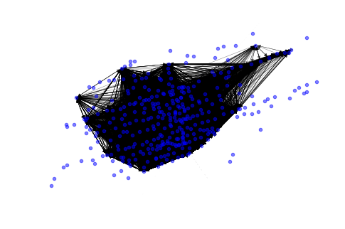

# Modeling Toronto Bikeshare Network
Using the NetworkX library to model and visualize the trip data for the Toronto Bikeshare Network (data from Q4 2016). Using LAT-LON coordinates at position attribute data we're able to visualize the network in the shape of the city.

You can find the data from Open Toronto: 

Bikeshare Trip Data:

https://www.toronto.ca/city-government/data-research-maps/open-data/open-data-catalogue/transportation/#343faeaa-c920-57d6-6a75-969181b6cbde

Bikeshare Locations:

https://www.toronto.ca/city-government/data-research-maps/open-data/open-data-catalogue/transportation/#84045f23-7465-0892-8889-7b6f91049b29

